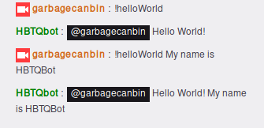

# Overview
Frendo is twitch-bot engine written in python which supports writing custom commands.
# Installation
1. Install Python 3 if you haven't already.
2. Either download or clone the repository.
3. Configure the bot using the provided template and save it as `~/.frendorc`.

```ini
;Example config for Frendo
[CHANNEL]
channel_name = lirik

[BOT]
bot_username = helloBot
oauth_token = oathkey
```

The file can be found [here](https://github.com/samhal/frendo/blob/master/etc/example_config.ini) or in `/etc/example_config.ini` in the dowloaded repository.

# Getting a OAuth token
1. Create a new account on [Twitch](https://www.twitch.tv/signup) or login to an existing account.
2. Connect your to [Twitch Chat OAuth Password Generator](http://www.twitchapps.com/tmi/) to generate OAuth token.

Use the account-name and OAuth token to configure the bot.

# Quick start
1. Navigate to the root of the project.
2. Run the bot by typing: `python frendo`

# Adding commands
Frendo supports adding custom commands.
This is done by adding a python file with the name of the command in `frendo/commands`.

```python
# frendo/commands/commandName.py
def commandName(user, args):
    return botReply
```

## Example
Let's say we want a command called
"helloWorld" that whenever requested replies "Hello World!" with the arguments concatenated to it.
First we create a file called `helloWorld.py` and save it `frendo/commands` then we create a function with
the same name as the command which takes the parameters `user` and `args`.

```python
# frendo/commands/helloWorld.py
def helloWorld(user, args):
    return "@{} Hello World! {}".format(user, " ".join(args))
```

The output will be:



The `user` parameter will contain the name of the user who requested the command. The `args` parameter
will contain a list of arguments. For instance if `!helloWorld` then `args = []`,
if `!helloWorld my name is` then `args = ['my', 'name', 'is']`.
